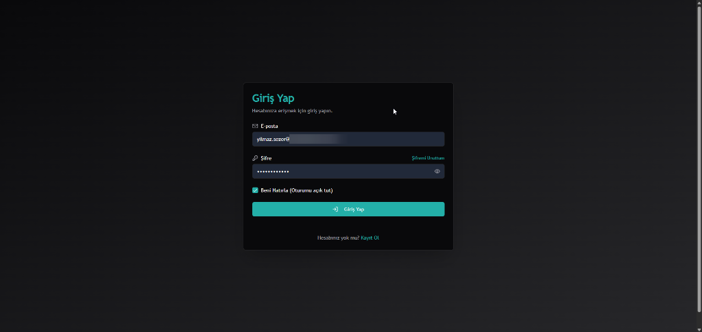
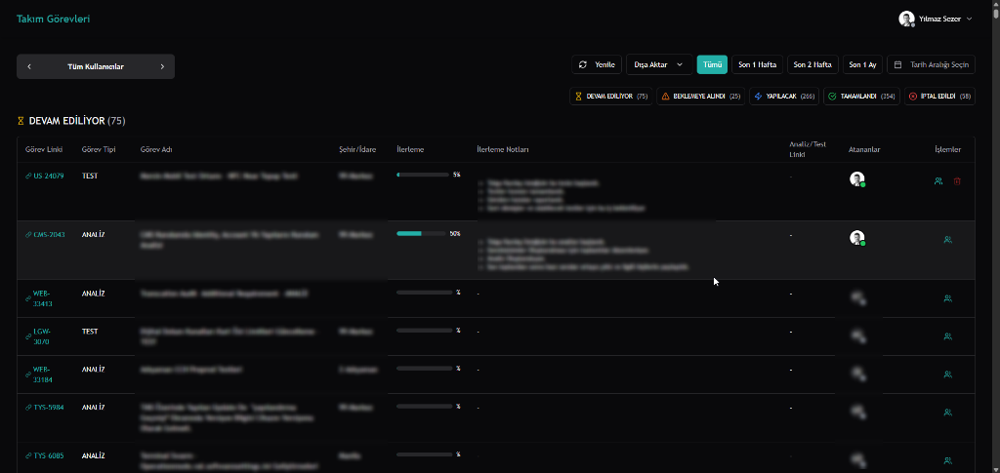
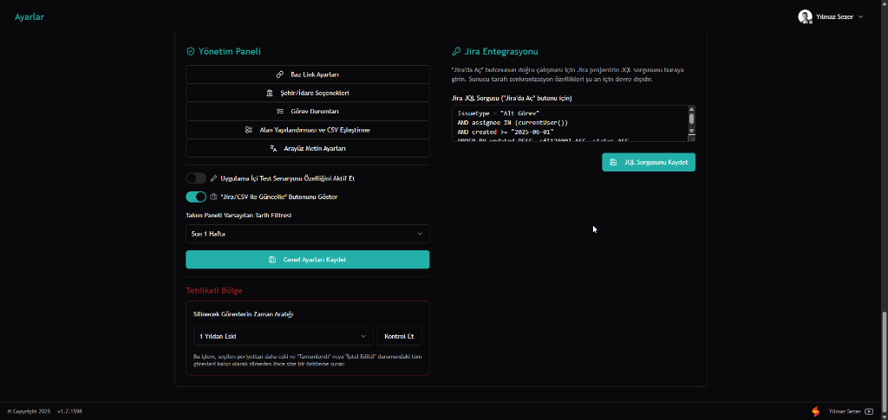
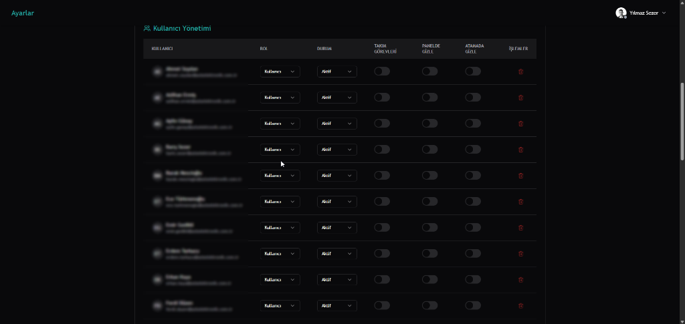
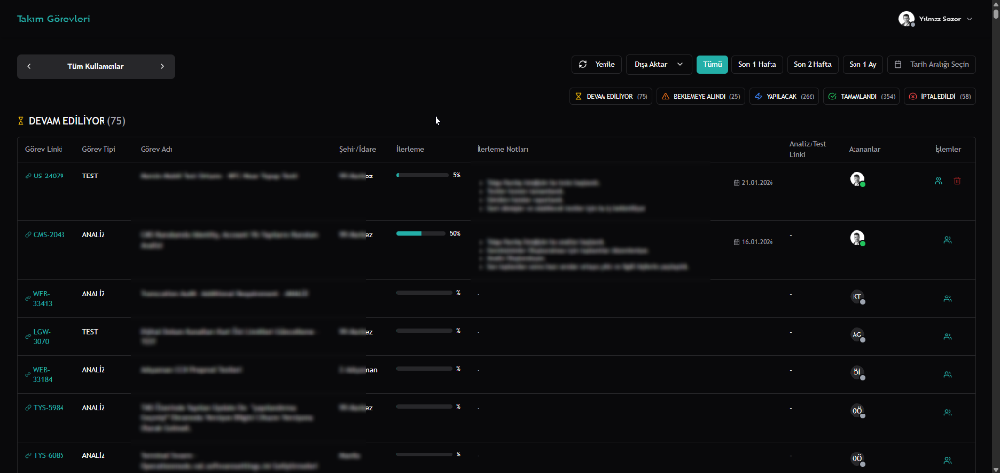
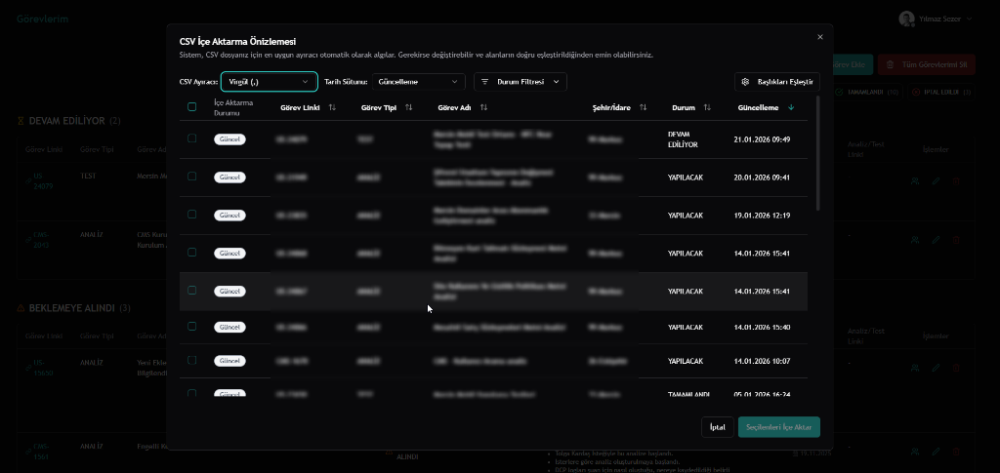
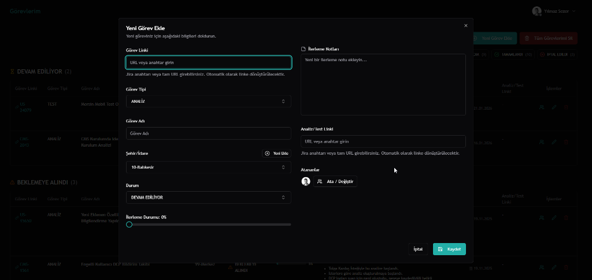
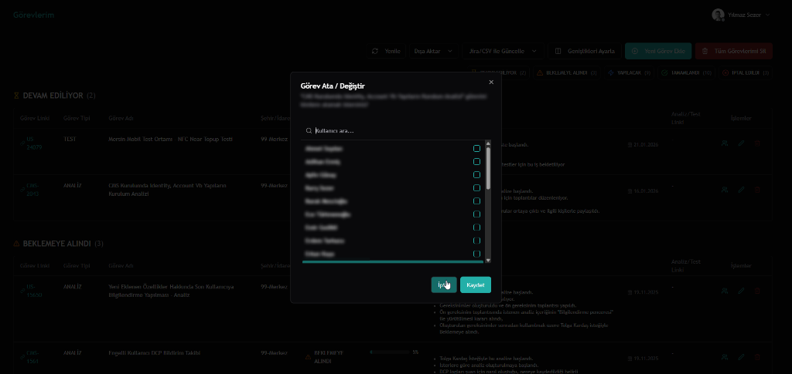

# Görev Yönetimi Uygulaması

Bu proje, modern web teknolojileri kullanılarak geliştirilmiş, kapsamlı ve özelleştirilebilir bir görev yönetimi platformudur. Excel tablolarının karmaşasına son vermek ve ekiplerin daha organize çalışmasını sağlamak amacıyla geliştirilmiştir.

---

## 📸 Uygulama Ekran Görüntüleri

| Giriş Ekranı | Takım Panosu (Dashboard) |
| :---: | :---: |
|  |  |

| Yönetim Paneli | Kullanıcı Yönetimi | Görev Detayları |
| :---: | :---: | :---: |
|  |  |  |

| CSV İçe Aktarma | Görev Ekleme | Kullanıcı Atama |
| :---: | :---: | :---: |
|  |  |  |

---

## ✨ Öne Çıkan Özellikler

- **Kişisel ve Takım Panoları:** Odaklanmış bireysel çalışma ve geniş bir ekip görünümü.
- **Dinamik Yönetici Paneli:** Sürükle-bırak ile görev durumlarını, form alanlarını ve arayüz metinlerini özelleştirin.
- **Akıllı Entegrasyonlar:** Tek tıkla Jira/CSV'den görev aktarın ve "Baz Link Sihirbazı" ile link yönetimini otomatikleştirin.
- **Uygulama İçi Test Yönetimi:** Görevlere bağlı test senaryoları oluşturun ve başarısız adımlardan otomatik olarak hata kaydı açın.
- **"Offline-First" Mimari:** Hızlı açılış ve internet bağlantısı olmadan bile akıcı kullanım.
- **Maliyet-Odaklı Tasarım:** Tüm altyapı, Firebase'in ücretsiz kotaları (Spark Plan) içinde çalışacak şekilde optimize edilmiştir.

## 🛠️ Kullanılan Teknolojiler

- **Frontend:** Next.js 15, React, TypeScript
- **Backend & Veritabanı:** Firebase (Authentication, Firestore)
- **UI:** Tailwind CSS, Shadcn/ui
- **State Management:** Zustand, React Context
- **Form Yönetimi:** React Hook Form, Zod

---

## ⚡ Hızlı Başlangıç (Local)

Projeyi bilgisayarınızda anında çalıştırmak için şu 3 adımı izleyin:

1.  **Paketleri Yükleyin:** `npm install`
2.  **Yapılandırmayı Oluşturun:** `.env.local` dosyası oluşturun ve Firebase bilgilerinizi girin (Detaylı bilgi aşağıda).
3.  **Çalıştırın:** `npm run dev`

---

## 🚀 Kurulum ve Başlangıç

Projeyi kurup çalıştırmak için iki seçeneğiniz bulunmaktadır.

### Seçenek 1: Firebase Studio ile Otomatik Kurulum (Tavsiye Edilen)

Firebase Studio, projenin kurulum ve Firebase entegrasyon adımlarını sizin için otomatik olarak yapar. Bu en hızlı ve en kolay yöntemdir.

1.  **Projeyi Klonlayın:** Firebase Studio'da yeni bir proje oluştururken "GitHub'dan Klonla" seçeneğini kullanın ve bu projenin URL'ini yapıştırın:
    ```
    https://github.com/yilmazsezer55/gorev-takibi.git
    ```

2.  **Firebase'i Kurun:** Proje yüklendikten sonra, sohbet asistanına (bana) aşağıdaki gibi bir komut vermeniz yeterlidir:
    > "Firebase'i kur" veya "Projeyi Firebase'e bağla"

    Asistan, sizin için otomatik olarak bir Firebase projesi oluşturacak, gerekli yapılandırma dosyalarını (`firebase.ts`) kodun içine ekleyecek ve güvenlik kurallarını (`firestore.rules`) dağıtacaktır. Manuel olarak hiçbir anahtar (API key) kopyalamanıza gerek kalmaz.

3.  **Çalıştırın:** Kurulum bittiğinde, proje otomatik olarak çalışmaya başlayacaktır.

### Seçenek 2: Yerel Bilgisayarda Manuel Kurulum

#### Ön Gereksinimler

- [Node.js](https://nodejs.org/) (v18 veya üstü)
- [Git](https://git-scm.com/)
- [Firebase CLI](https://firebase.google.com/docs/cli): `npm install -g firebase-tools`

#### Kurulum Adımları

1.  **Projeyi klonlayın:**
    ```bash
    git clone https://github.com/yilmazsezer55/gorev-takibi.git
    cd gorev-takibi
    ```

2.  **Gerekli paketleri yükleyin:**
    ```bash
    npm install
    ```

#### Firebase Kurulumu (Hassas Bilgi Uyarısı!)

Bu projede güvenlik için Next.js **Environment Variables** kullanılmaktadır. Bilgilerinizi doğrudan kodun içine yazmak yerine bir gizli dosyada tutmanız önerilir.

1.  **Firebase Projesi Oluşturun:**
    -   [Firebase Console](https://console.firebase.google.com/)'da proje oluşturun.
    -   **Authentication** (E-posta/Şifre) ve **Firestore** özelliklerini aktif edin.

2.  **Yapılandırmayı Projeye Ekleyin:**
    -   Proje kök dizininde `.env.local` isimli bir dosya oluşturun.
    -   Firebase Konsolu'ndan aldığınız bilgileri bu dosyaya şu formatta işleyin:

    ```env
    NEXT_PUBLIC_FIREBASE_API_KEY=SİZİN_API_ANAHTARINIZ
    NEXT_PUBLIC_FIREBASE_AUTH_DOMAIN=SİZİN_PROJE_ID.firebaseapp.com
    NEXT_PUBLIC_FIREBASE_PROJECT_ID=SİZİN_PROJE_ID
    NEXT_PUBLIC_FIREBASE_STORAGE_BUCKET=SİZİN_PROJE_ID.appspot.com
    NEXT_PUBLIC_FIREBASE_MESSAGING_SENDER_ID=SİZİN_SENDER_ID
    NEXT_PUBLIC_FIREBASE_APP_ID=SİZİN_APP_ID
    ```
    *Not: Bu yöntem sayesinde bilgileriniz GitHub'a yüklendiğinde sızmaz.*

#### Geliştirme Sunucusunu Başlatma

```bash
npm run dev
```
Uygulamaya `http://localhost:9002` (veya terminalde belirtilen port) üzerinden erişebilirsiniz.

---

## ☁️ Yayına Alma (Deployment)

Projeyi Firebase Hosting üzerinde canlıya almak için:

```bash
firebase login
firebase use SIZIN_PROJE_ID
npm run build
firebase deploy --only hosting
```

---

## 🤝 Katkıda Bulunma

Katkılarınız projeyi daha da ileriye taşıyacaktır! Lütfen bir "pull request" açmaktan çekinmeyin.

---

## 📖 Detaylı Kurulum Rehberi
Daha fazla detay ve ekran görüntüleri için [Yeniden Kullanım Rehberi'ne (REUSE_GUIDE_TR.md)](REUSE_GUIDE_TR.md) göz atabilirsiniz.
